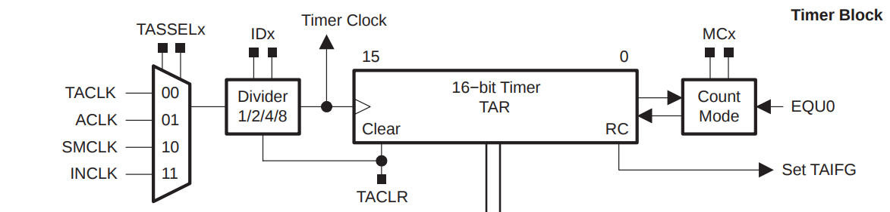
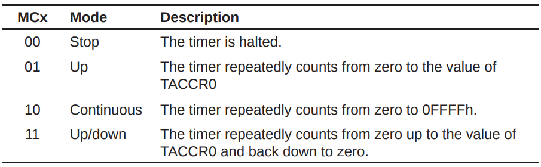

# Dive into Timer

```c
#include <msp430.h> 

unsigned int i = 0, j = 0, dir = 0;
unsigned int flag = 0;  // flag--灯光流动方式, 0-灯的点亮顺序D3 -> D1; 1-灯的点亮顺序D1 -> D3
unsigned int speed = 1;  // speed--灯光流动速度, 取值0~3

void main(void)
{
    WDTCTL = WDTPW + WDTHOLD;       // Stop WDT

    CCTL0 = CCIE;                   // CCR0 interrupt enabled
    CCR0 = 50000;
    TACTL = TASSEL_2 + ID_3 + MC_1; // TimerA source-clock select SMCLK; UP mode
    P2DIR |= (BIT0 | BIT1 | BIT2 | BIT3);      // set P2 0-3 as output
    P2OUT = 0x00;                              // clear P2

    _EINT();                        // Enable the global interrupt
    // LPM0;                        // Enter low power mode

    while (1)
        ;
}

#pragma vector = TIMERA0_VECTOR
__interrupt void Timer_A(void)
{
    if (flag == 0)
    {
        P2OUT = (0x08 >> (i++));    // 灯的点亮顺序D3 -> D1
    }
    else if (flag == 1)
    {
        P2OUT = (0x01 << (i++));    // 灯的点亮顺序D1 -> D3
    }
    else
    {
        if (dir)          // 灯的点亮顺序D3 -> D1, D1 -> D3, 循环绕圈
        {
            P2OUT = (0x08 >> (i++));
        }
        else
        {
            P2OUT = (0x01 << (i++));
        }
    }

    if (i == 4)
    {
        i = 0;
        dir = ~dir;
    }

    j++;
    if (j == 40)
    {
        i = 0;
        j = 0;
        flag++;

        if (flag == 4)
            flag = 0;

        switch (speed)
        {
        case 0:
            TACTL &= ~(ID0 + ID1);
            TACTL |= ID_3;
            break;
        case 1:
            TACTL &= ~(ID0 + ID1);
            TACTL |= ID_2;
            break;
        case 2:
            TACTL &= ~(ID0 + ID1);
            TACTL |= ID_1;
            break;
        case 3:
            TACTL &= ~(ID0 + ID1);
            TACTL |= ID_0;
            break;
        default:
            break;
        }

        if (flag != 3)
            speed++;
        if (speed == 4)
            speed = 0;
    }
}
```

## Hardware



> TAR\(timerA register\) is a 16-bit counting register. This register is the thing that gets incremented \(or decremented\) as the timer counts up \(or down\). The “15” and “0” shows that the timer is 16-bits wide: it starts at bit 0 and goes up to bit 15; that’s 16 bits in total.

> The left part shows four signals: TACLK, ACLK, SMCLK, and INCLK. These are four different clock signals inside the MSP430. You select which of the four to use as the timer input clock using the _TASSEL_ bits inside the timer peripheral configuration registers. TASSEL stands for `Timer A Source-clock Select` .

> `IDx` can divide its input signal by 1, 2, 4, or 8. For example, if we set the ID divider to divide by 4 \(commonly written as “/4”\), it would take the input clock of 32768 Hz, divide it by 4, and the output would be 32768/4 = 8192 Hz. The divide by 1 \(or “/1”\) setting simply passes through the input signal unchanged.

> What’s the point of the divider?
>
> The micro-controller designer doesn’t know how fast \(or slow!\) you’ll want to run your timer, so they want to give you as much flexibility as possible.
>
> If they gave you no dividers at all, then you’d be stuck with whatever speed the four input clocks happened to be running at. 
>
> Having a divider is better than no options.

`Timer A register` will count at 32768 Hz, meaning it will tick 32768 times per second.

`Timer A register` ~~will count at 32768 Hz, meaning TACCR\(Timer A Capture/Compare Register\) will increase 32768 per second~~.

## Timer Modes



~~It seems like you should chose Up mode if you want to control your timer by using TACCR0.~~

$$
0ffff \approx 32768 \times 2 = 65536
$$

## Interrupt

~~If you have set an Interrupt Service Routine, then that function will be called every time timer register overflows from 0xFFFF or TACCR0 back to zero.~~ 

## What about the codes above?

For this section, the program does not important, the theory does.

## References:





