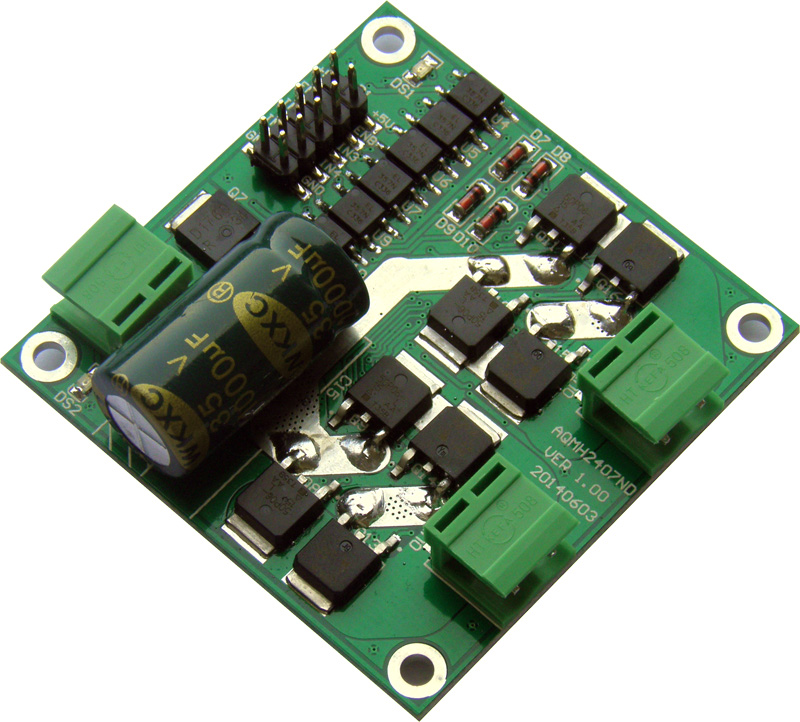
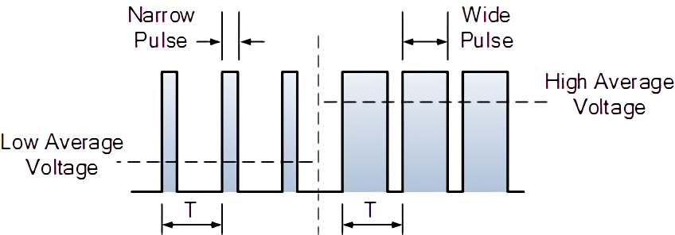

# Motor Driver

## Introduction

`Motor Driver` is a device that you have to use to drive your motor by micro-controller's pin output.

In here, we gonna use `AQMH2407ND`. It's made by Chinese probably. 



It got three pins:

* In1 \(input 1\)
* Ln2 \(input 2\)
* En \(enable\)

| Input 1 | Input 2 | Enable | Function |
| :--- | :--- | :--- | :--- |
| 0 | 0 | whatever | stop |
| 1 | 1 | whatever | still |
| 1 | 0 | \(0, 1\] or PWM | forward |
| 0 | 1 | \(0, 1\] or PWM | backward |

`(0, 1]` means how long you set `Enable pin` to 1 during a period of time. For example, if we set `Enable pin` to `1` remaining 0.5 second, then set `Enable pin` to `0` remaining another 0.5 second, do this over and over again. In the end, we'll get an average speed for our motor. 

PWM: Pulse Width Modulated Waveform



## Codes without Speed Control

```c
#include <msp430.h>

#define pin_of_motor1_driver_input1 BIT0
#define pin_of_motor1_driver_input2 BIT1
#define pin_of_motor1_driver_enable BIT2 // to give the power to the circuit

#define pin_of_motor2_driver_input1 BIT3
#define pin_of_motor2_driver_input2 BIT4
#define pin_of_motor2_driver_enable BIT5 // to give the power to the circuit

#define set_all_motor_pin_as_output                                            \
    P3DIR |= (pin_of_motor1_driver_input1 | pin_of_motor1_driver_input2 |      \
              pin_of_motor1_driver_enable | pin_of_motor2_driver_input1 |      \
              pin_of_motor2_driver_input2 | pin_of_motor2_driver_enable)

#define set_pin_of_motor1_driver_input1_to_0                                   \
    P3OUT &= ~pin_of_motor1_driver_input1 // P3 means Port3, and Port3 has 8
                                          // pins from P3.0 to P3.7
#define set_pin_of_motor1_driver_input1_to_1                                   \
    P3OUT |= pin_of_motor1_driver_input1 // P3 means Port3, and Port3 has 8 pins
                                         // from P3.0 to P3.7
#define set_pin_of_motor1_driver_input2_to_0                                   \
    P3OUT &= ~pin_of_motor1_driver_input2 // P3 means Port3, and Port3 has 8
                                          // pins from P3.0 to P3.7
#define set_pin_of_motor1_driver_input2_to_1                                   \
    P3OUT |= pin_of_motor1_driver_input2 // P3 means Port3, and Port3 has 8 pins
                                         // from P3.0 to P3.7
#define set_pin_of_motor1_driver_enable_to_0                                   \
    P3OUT &= ~pin_of_motor1_driver_enable // P3 means Port3, and Port3 has 8
                                          // pins from P3.0 to P3.7
#define set_pin_of_motor1_driver_enable_to_1                                   \
    P3OUT |= pin_of_motor1_driver_enable // P3 means Port3, and Port3 has 8 pins
                                         // from P3.0 to P3.7

#define set_pin_of_motor2_driver_input1_to_0                                   \
    P3OUT &= ~pin_of_motor2_driver_input1 // P3 means Port3, and Port3 has 8
                                          // pins from P3.0 to P3.7
#define set_pin_of_motor2_driver_input1_to_1                                   \
    P3OUT |= pin_of_motor2_driver_input1 // P3 means Port3, and Port3 has 8 pins
                                         // from P3.0 to P3.7
#define set_pin_of_motor2_driver_input2_to_0                                   \
    P3OUT &= ~pin_of_motor2_driver_input2 // P3 means Port3, and Port3 has 8
                                          // pins from P3.0 to P3.7
#define set_pin_of_motor2_driver_input2_to_1                                   \
    P3OUT |= pin_of_motor2_driver_input2 // P3 means Port3, and Port3 has 8 pins
                                         // from P3.0 to P3.7
#define set_pin_of_motor2_driver_enable_to_0                                   \
    P3OUT &= ~pin_of_motor2_driver_enable // P3 means Port3, and Port3 has 8
                                          // pins from P3.0 to P3.7
#define set_pin_of_motor2_driver_enable_to_1                                   \
    P3OUT |= pin_of_motor2_driver_enable // P3 means Port3, and Port3 has 8 pins
                                         // from P3.0 to P3.7

void millisecond_level_of_delay(unsigned int t) {
    while (t--) {
        // delay for 1ms
        __delay_cycles(1000);
    }
}

void stop_motor(int which_motor) {
    if (which_motor == 1) {
        set_pin_of_motor1_driver_input1_to_0;
        set_pin_of_motor1_driver_input2_to_0;
    } else if (which_motor == 2) {
        set_pin_of_motor2_driver_input1_to_0;
        set_pin_of_motor2_driver_input2_to_0;
    }
}

void make_the_motor_still(int which_motor) {
    if (which_motor == 1) {
        set_pin_of_motor1_driver_input1_to_1;
        set_pin_of_motor1_driver_input2_to_1;
    } else if (which_motor == 2) {
        set_pin_of_motor2_driver_input1_to_1;
        set_pin_of_motor2_driver_input2_to_1;
    }
}

void motor_forward(int which_motor, int speed) {
    if (which_motor == 1) {
        set_pin_of_motor1_driver_input1_to_1;
        set_pin_of_motor1_driver_input2_to_0;

        set_pin_of_motor1_driver_enable_to_1;
    } else if (which_motor == 2) {
        set_pin_of_motor2_driver_input1_to_1;
        set_pin_of_motor2_driver_input2_to_0;

        set_pin_of_motor2_driver_enable_to_1;
    }
}

void motor_backward(int which_motor, int speed) {
    if (which_motor == 1) {
        set_pin_of_motor1_driver_input1_to_0;
        set_pin_of_motor1_driver_input2_to_1;

        set_pin_of_motor1_driver_enable_to_1;
    } else if (which_motor == 2) {
        set_pin_of_motor2_driver_input1_to_0;
        set_pin_of_motor2_driver_input2_to_1;

        set_pin_of_motor2_driver_enable_to_1;
    }
}

int main(void) {
    WDTCTL = WDTPW | WDTHOLD; // stop watchdog timer

    set_all_motor_pin_as_output;

    while (1) {
        motor_forward(1, 255);
        millisecond_level_of_delay(2 * 1000);
        stop_motor(1);
        millisecond_level_of_delay(2 * 1000);
        motor_backward(1, 255);
        millisecond_level_of_delay(2 * 1000);
    }

    return 0;
}
```

## Codes with PWM speed control

### A simple demo demonstrated how PWM works in MSP430

```c
#include <msp430.h>

int main(void) {
    WDTCTL = WDTPW + WDTHOLD; // Stop WDT

    // Why I choose the following pins? Because the pin-map says they are TACLK(TA0-2) pin.
    P1DIR |= (BIT6 | BIT7);   // P1.6 and P1.6 output
    P1SEL |= (BIT6 | BIT7);   // P1.6 and P1.6 TA1/2 otions

    CCR0 = 1000 - 1;          // PWM Period, for 1 MHz, 1000 means 1 ms. 1ms != 1us.
    CCTL1 = OUTMOD_7;         // CCR1 reset/set
    CCR1 = 800;               // CCR1 PWM duty cycle, output 80% Power
    CCTL2 = OUTMOD_7;         // CCR2 reset/set
    CCR2 = 500;               // CCR2 PWM duty cycle, output 50% Power

    TACTL = TASSEL_2 + MC_1;  // SMCLK, up mode
}
```

### Conbined with Motor Driver

```c

```

