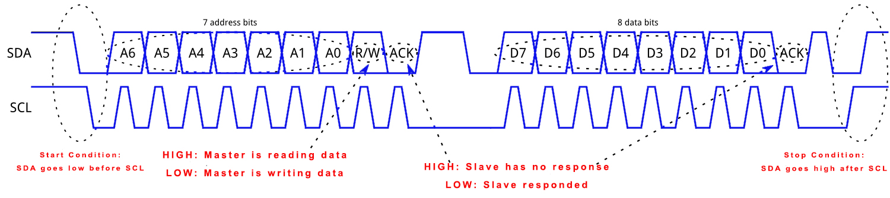

# MPU-6050

## Introduction

### The Shape of that Chip

The InvenSense MPU-6050 sensor contains a MEMS accelerometer and a MEMS gyro in a single chip.

> MPU: Micro Processor Unit

> MEMS: _Micro Electro Mechanical Systems_

> I2C: Inter-Integrated Circuit

> GY52 or GY521 is Breakout Board. Don't ask me what is Breakout Board, I don't know either.

When this device stays still, the raw value you read from accelerometer or gyro will be a constant value. But when you move that device fast, the accelerometer will return an unstable value compare to the gyro. By the way, they all return x,y,z values.

### I2C \(Inter-Integrated Circuit\)

I²C, pronounced I-squared-C, is a synchronous, multi-master, multi-slave, packet switched, single-ended, serial computer bus invented in 1982 by Philips Semiconductor. It is widely used for attaching lower-speed peripheral ICs to processors and micro-controllers in short-distance, intra-board communication.

## Communication Protocol

USART: Universal Synchronous Asynchronous Receiver Transmitter

Here we use `I2C protocol`, it's different than `SPI protocol`.

There has a lot of details about how to configure I2C in `MSP430 User Guide.pdf`. You just have to search keyword like `I2C Mode` to get it.

## References:







